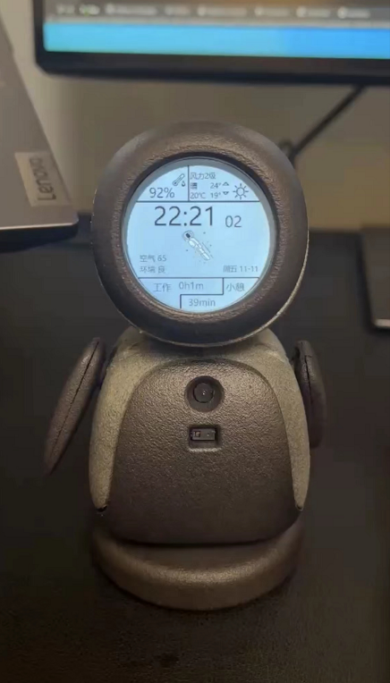

# 本项目复刻了稚晖君的ElectronBot, 总结了一些经验总结在此, 并实现了python调用lowlevel.dll, 实现舵机数据设置并回传, 视频图像\摄像头图像\华为太空人图像(实现时间与天气)的传输

## 1.Hardware 文件夹中添加了网友提供的完整的采购BOM, 和将多个PCB拼版成2个PCB, 方便大家制版和采购

## 2.Firmware 文件夹中3个项目通过clion都可以完整编译, 之前尝试转为MDK工程, 但是对于新手来说转移过程容易出错, 所以建议直接用clion, 最后结果也是正确的, clion确实很好用

## 3.Software 文件夹, 主要关注点在SDK和Unity.
- SDK中最底层为lowlevel, 内部主要调用2个模块, 一个是封装了libusb的USBInterface.dll. 另一个是opencv3.4.8. 这个库稚晖君提供了,但是需要放到工程指定的位置, 或者修改工程的cmakelist来找到它. (注意: 本项目中提供的工程是都是基于opencv4.6.0重新编译过的)
- player调用了lowlevel, 方便用户调用使用
- unitybridge也调用了lowlevel. 
- unity为3维编程, 稚晖君使用了C#调用unitybridge.dll, 文件夹中包含已编译好的Release和源文件studio.(注意: Release执行会报错, 需要替换Release\Build\ElectronBot-Studio_Data\Plugins\x86_64\opencv_world348d.dll文件, 本项目已经替换好, 可以正常运行, Studio项目还未仔细学习, 所以暂时无经验)

## 4. CAD-Model: 稚晖君提供了设计文件step文件, 可用fusion360正常打开, 后期想要打印最好将其中的零部件导成stl文件. 本文件夹提供了
- 网友整合多个小零部件为一体的单板stl
- 加厚了身体前后壳中, 嘉立创反馈的局部太薄区域
- 整理了打印列表

## 5.Docs: 根据源代码, 整理了 PCsoft和下位机之间的通讯协议. 而主板和舵机的通讯协议, 稚晖君已经提供

## 6.Tests:
- TestDisplayUSB: 稚晖君提供的用来单独测试液晶和PCsoft与下位机通讯的工程. (注意: 需要同时使用专用的固件和软件)
- TestDisplayUSB: 根据网友提供的思路, 本人编写的单独测试舵机的固件, 分别用来测试单个和6个舵机

---
`以下为本项目主要做的额外的一些学习和后续工作, 主要目的是将稚晖君提供的SDK移植为python可调用接口, 这样后期利用python的便利性, 便于结合机器学习, 图像识别, 目录地址为6.Tests/ClionStudy/****`

C++ 生成与调用 dll 实验, 主要用来学习 clion和cmakelist
1.clion_lib_shared:	只生成动态库的程序
2.clion_lib_static:	只生成静态库的程序
3.clion_lib_exe: 	调用2步生成的dll, 同时生成新动态库和exe的程序
4.clion_exe: 	调用第3步生成的dll,生成exe程序
5.clion_opencv:	app应用程序,调用opencv库

python 使用ctypes调用C++生成的dll 实验, 预演python接口
6.1vs_lib_shared:		visual studio ide生成动态库程序, 用以被python调用
6.2clion_lib_shared:		只生成动态库的程序, 其中.h文件中添加了extern "C" __declspec(dllexport), 用以被python调用
6.3python:		python ctype调用第6.1步/第6.2步生成的dll
6.4clion_lib_shared:		功能和6.2类似,只是代码实现方式有些区别
6.5python:		功能和63类似,只是代码实现方式有些区别

针对ElectronBot项目, 将LowLevel重新封装dll, 并用python调用, 实现图像数据传输, 舵机数据设置和回传
7.1 ElectronBotSDK-LowLevel:	重新修改封装了底层库dll
7.2 PythonTestDisplayUSB:		调用7.1实现舵机数据设置并回传, 视频图像\摄像头图像\华为表盘图像(实现时间与天气)的传输

libusb 模块使用, 主要用来学习libusb驱动使用
8.libusb_demo/USB_VCP_Test:		STM32CubeMX生成的STM32 USB VCP HP 工程
8.libusb_demo/USB_VCP_Test_libusbDriver:	对应的libusb安装驱动, 对应于STM32工程中修改VID, PID
8.libusb_demo/libusb-win32-install-1.2.6.0.zip:	用于生成libsub驱动的程序

